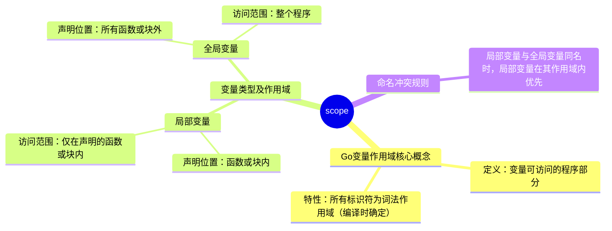

# 作用域

在Go语言中，变量的**作用域**指变量可被访问的程序部分，所有标识符均为**词法作用域**（编译时可确定），变量仅在定义它的代码块内可访问。主要包括**局部变量**（在函数或块内声明，仅在该范围内可访问）、**全局变量**（在函数外声明，整个程序可访问），且当局部变量与全局变量同名时，**局部变量在其作用域内优先**。

---
   


---

### 一、变量作用域的基本概念
- **定义**：变量的作用域是指程序中该变量可以被访问的部分。
- **特性**：在Go语言中，所有标识符都是**词法作用域**，这意味着变量的作用范围可以在编译时就确定，变量仅能在定义它的代码块内被访问。

### 二、变量的类型及特点
| 变量类型 | 声明位置 | 访问范围 | 示例说明 |
|----------|----------|----------|----------|
| **局部变量** | 在函数内部或代码块（如循环、条件语句块）内声明 | 仅在声明它的函数或代码块内可访问，超出该范围则无法访问 | 在`main`函数中声明`var localVar int = 200`，该变量只能在`main`函数内被打印输出，其他函数无法访问 |
| **全局变量** | 在所有函数和代码块的外部声明 | 可以在整个程序的任意函数或代码块中被访问 | 在程序开头声明`var myVariable int = 100`，`main`函数和`display`函数都能访问并打印该变量 |

### 三、局部变量与全局变量的命名冲突处理
- 当局部变量与全局变量名称相同时，**局部变量在其作用域内具有更高的优先级**，即程序在该作用域内会优先使用局部变量的值。
- 示例：全局变量`myVariable`为100，`main`函数中声明同名局部变量为200，打印时输出200（局部变量的值）。

### 四、示例代码及输出
- 综合示例代码：
```go
package main
import "fmt"

// 全局变量
var myVariable int = 100

func main() {
    // 局部变量
    var localVar int = 200
    fmt.Printf("Inside main - Global variable: %d\n", myVariable)
    fmt.Printf("Inside main - Local variable: %d\n", localVar)
    
    // 局部与全局变量同名示例
    var myVariable int = 200
    fmt.Printf("Local variable takes precedence: %d\n", myVariable)
    
    display()
}

func display() {
    fmt.Printf("Inside display - Global variable: %d\n", myVariable)
}
```
- 输出：
```
Inside main - Global variable: 100
Inside main - Local variable: 200
Local variable takes precedence: 200
Inside display - Global variable: 100
```

---

> 问题：Go语言中变量的作用域是如何确定的？与其他语言相比有何特点？

  Go语言中变量的作用域通过**词法作用域**确定，即编译时就能明确变量可被访问的范围，变量仅在定义它的代码块内可访问。与部分动态作用域的语言相比，其作用域在编译阶段固定，更便于代码分析和调试。

> 问题：局部变量和全局变量在声明位置和访问范围上有何本质区别？

  局部变量在**函数或代码块内**声明，仅能在该函数或代码块内被访问；全局变量在**所有函数和代码块外**声明，可在**整个程序的任意部分**被访问。这一区别决定了全局变量适合存储整个程序需要共享的数据，而局部变量适合函数内部的临时计算。

> 问题：当局部变量与全局变量同名时，程序会如何处理？为什么这样设计？

  此时**局部变量在其作用域内优先被使用**。这样设计是为了允许函数内部根据自身需求定义变量，避免因全局变量的存在而限制局部逻辑的实现，同时减少命名冲突对局部代码的干扰，增强函数的封装性。
